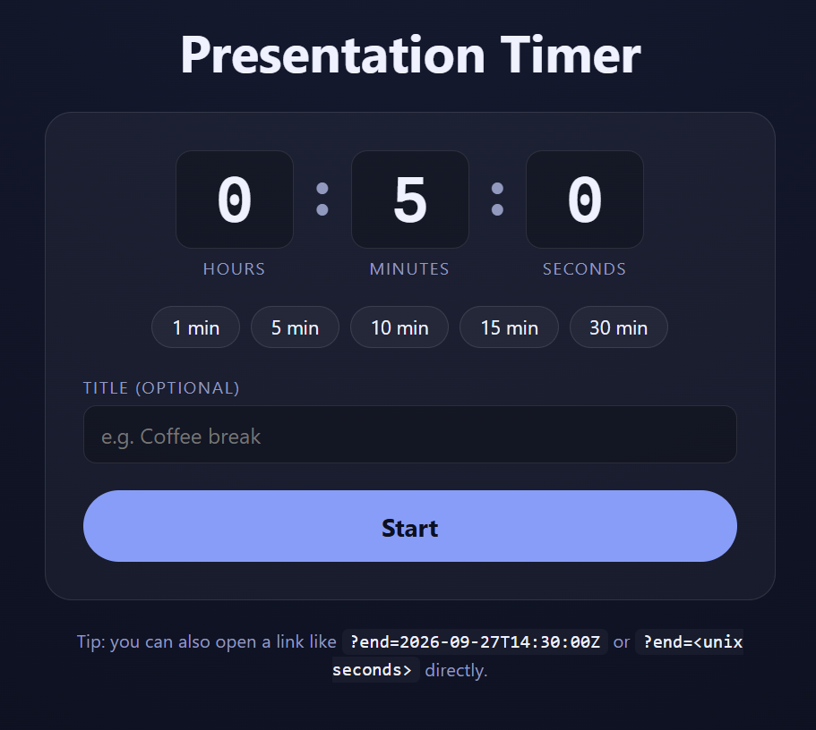
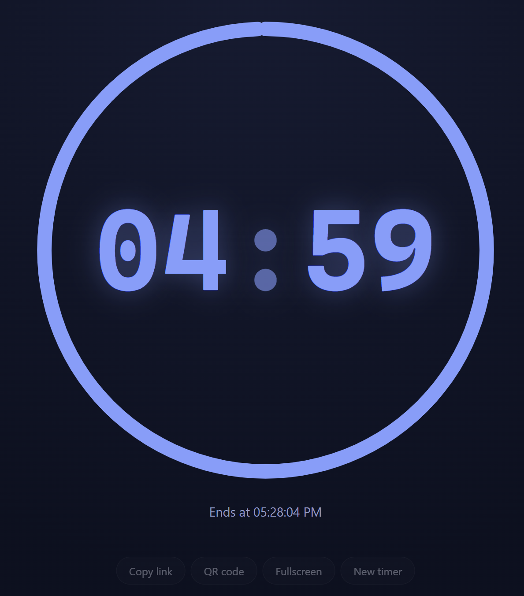
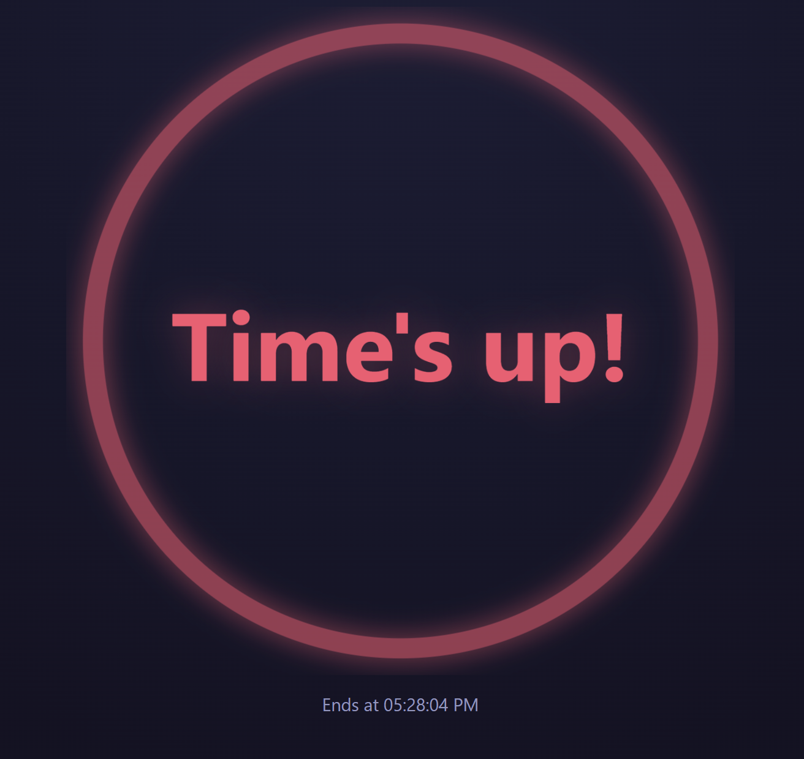
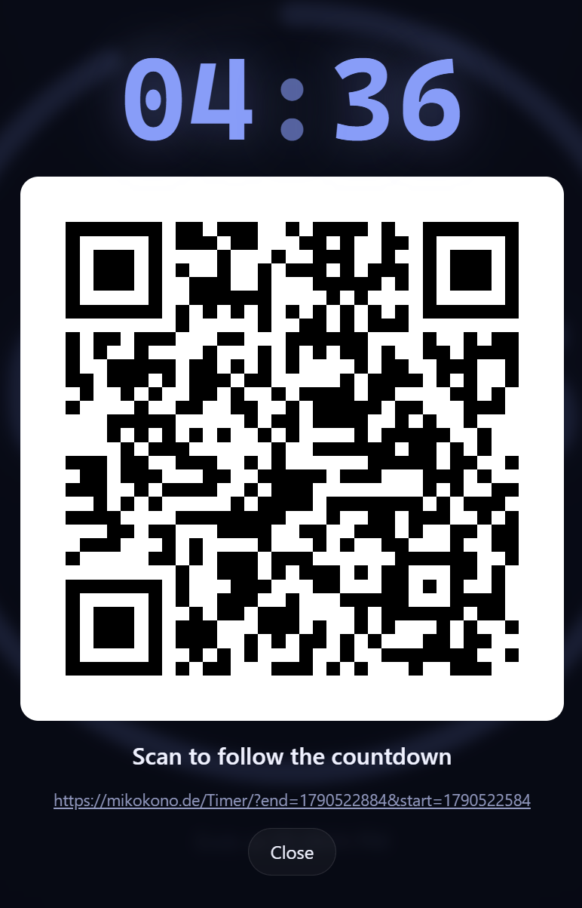

# ⏱️ Presentation Timer

A simple, full-screen countdown timer for presentations, talks, workshops, and breaks. Set a duration, add an optional title, and share the countdown so everyone can follow along.

- 🕒 Choose a duration in hours, minutes, and seconds, or use a quick preset.
- 🎤 Keep the countdown large and visible while presenting.
- 🔗 Share a link or open the built-in QR code so attendees can open the same timer.
- ✍️ Add an optional title, such as "Coffee break" or a session name.

## 📸 Screenshots

### 🛠️ Set up a timer

Choose a duration and optional title, then start the countdown.

### ⏳ Follow the countdown

The active timer fills the screen, with controls for copying the link, opening a collapsed share section with the QR code, switching to fullscreen, or starting a new timer.

### 🎉 When time is up

The timer makes it clear when the countdown has finished.

### 📱 Share the timer

Attendees can expand the share section to copy the link or scan the QR code on their own device.

## ⚙️ Technical details

For URL parameters, GitHub Pages behavior, local development, and deployment instructions, see [Technical Details](TECHNICAL_DETAILS.md).